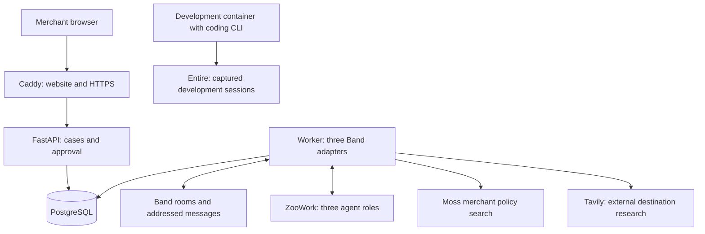

# Smarter Returns: Implementation Plan

## 1. Goal and scope

Build a hosted application that helps a merchant send a returned item to the best eligible destination: a waiting buyer, an inspection center, a repair business, or the merchant’s warehouse.

The product must do more than recommend a destination. It must hold the item for a buyer, prevent competing claims, block an unsuitable route, and change the plan when new information arrives. A merchant approves the final plan.

This document is a plan. No application, containers, accounts, or deployment have been created. Commands and configuration below describe files and functions the implementation must provide.

### Requirements from this conversation

- Implement the Smarter Returns idea in a way that could support a sponsor-prize submission.
- Integrate ZooWork, Band, Tavily, Moss, and Entire with clear, meaningful roles.
- Provide a Docker setup so Node, Python, database tools, and sponsor development tools do not need separate installation on the laptop.
- Make the application hostable, including its continuously running agents.
- Keep the first version small enough to attempt in three hours.
- Explain the plan in plain language, with technical detail where needed to build it.

### Requirements from the PowerPoint

The source is [AI Commerce Gallery Opening Ceremony.pptx](<AI Commerce Gallery Opening Ceremony.pptx>).

| Deck requirement or judging point | Implementation response | Evidence to prepare |
| --- | --- | --- |
| Pick a real merchant and improve one part of its business, slide 13 | Choose one actual retailer and focus on return handling and shipping cost | Merchant identity, workflow description, and the policy it supplied |
| Something a merchant would pay for and could run on Monday, slide 14 | Persistent cases, explicit approval, recovery after a restart, and a hosted URL | Complete approved case, restart check, and honest limitations |
| Approach and business viability, slide 66 | Compare feasible return routes against the merchant’s warehouse route | Itemized cost comparison with assumptions labeled |
| Functional primary features, slide 66 | Run intake, matching, policy review, reservation, approval, and rerouting | Working end-to-end case and failure case |
| Thoughtful design and X-Factor, slide 66 | One clear decision screen showing why a route was blocked or selected | Visible change after an inspection finding |
| Best Use of ZooWork, Band, and Entire, slides 59–61 | Core agent execution, essential coordination, and captured development work | Sponsor-specific records described below |
| Submission by 5 PM on October 3, 2026, slides 22 and 67 | Finish hosting and submission materials within the build window | URL and completed submission |

The deck does not provide complete sponsor-award rules, required submission fields, or a guarantee that awards can be combined. Check the event submission page and organizers’ resource channel before building. Record any additional rules in this document. Sponsor documentation informs implementation but does not replace event rules.

**Unresolved requirement:** No real merchant has been selected. Use a consenting retailer’s name and supplied policy where possible. Synthetic data supports a technical prototype, but does not establish that the real-merchant brief has been satisfied. Do not invent merchant participation or measured savings.

### Time reality

A three-hour implementation with all five sponsors and hosting is an aggressive target, particularly for one person starting without accounts. It depends on credentials, a hosting machine, and compatible SDKs being ready. Budget a longer session if these are not ready. The three-hour schedule below retains every sponsor and cuts optional features instead.

## 2. What the first version does

Sample input files are now available in [fixtures/README.md](fixtures/README.md), with ten scenario specifications, five products, four waiting buyers, fixed cost estimates, and a policy ready to index in Moss. These files are synthetic inputs; the loader and application still need implementation. Use a fresh synthetic dataset for each scenario.

Start with one merchant, one non-sensitive product category, five sample products, ten return cases, and a few waiting buyers. Lamps or simple home accessories are suitable examples. Avoid food, medical products, or complex condition assessment.

The merchant can:

1. Submit a return with a product, general location, condition, and explanation.
2. Watch agents collect policy evidence and find destinations.
3. Compare eligible routes and their estimated costs.
4. See an item reserved for a waiting buyer.
5. Approve or reject the proposed route.
6. Record an inspection finding and watch the route change.
7. Open the Band room and the source passages behind a decision.

Use synthetic customers, fixed shipping estimates, and simulated shipment creation. Label all three. Real carrier labels, refunds, customer messages, computer vision, and automatic resale are later work.

The useful merchant outcome is a reviewable routing decision with a saved operational record. A Monday pilot would still need real order and carrier connections before handling actual shipments.

## 3. Sponsor roles

| Sponsor | Essential role in this design | What judges should be able to inspect |
| --- | --- | --- |
| ZooWork | Runs three separate agents and their tool use | Agent IDs, case sessions, tool requests, and execution results |
| Band | Delivers addressed requests and findings between those agents | A room where fulfillment depends on returns findings and policy review can block a route |
| Moss | Finds merchant policy and inspection evidence | Retrieved passage IDs, policy version, and the resulting eligibility decision |
| Tavily | Finds external repair or resale candidates when ordinary routes fail | Actual search/extraction result, source URL, fetched time, and a candidate requiring verification |
| Entire | Captures development sessions behind committed work | A genuine captured session tied to the reservation or policy-block implementation |

The application database remains the authoritative record of cases and reservations. Sponsor histories explain work and coordination; they do not replace transaction checks.

### ZooWork: the agents’ workplace

Use the async Python `zoowork` client. Create one configured agent per role, start them, and keep separate conversations for each case and role. The official SDK documents these operations and resumable event reading. [ZooWork Python SDK](https://zoowork.ai/docs/en/reference/python-sdk)

Declare application-executed tools so agents can ask the worker to read case data, query Moss, research through Tavily, and perform permitted business actions. The worker validates requests, executes them, and returns results. The current docs describe `agent.custom_tool_use`, `custom_tool_use()`, and `resolve_custom_tool_call()`; verify them with the pinned SDK in the first setup check. [ZooWork custom tools](https://zoowork.ai/docs/en/build/tools)

Do not give agents arbitrary database access. Keep sponsor keys and database credentials in the worker, outside model messages. Select an available model during setup and save its configured identifier.

### Band: the agents’ communication channel

Register three distinct remote agents with their own IDs, keys, and handles. For each return, create one Band room and add the participants. Normal handoffs must be agent-selected addressed messages. A policy finding changes another agent’s work, and a block prevents approval. This matches the meaningful-use guidance in Band’s hacker guide. [Band hacker guide](https://www.band.ai/hacker-guide)

Band’s Python SDK accepts custom adapters. Build `ZooWorkBandAdapter` using the official adapter interface. The existing SDK supports the connection, while this project supplies the ZooWork bridge. No ready-made ZooWork adapter is assumed. [Band SDK reference](https://docs.band.ai/integrations/sdks/reference)

Bridge behavior:

1. Receive a Band message addressed to this role.
2. Resolve its room to a trusted case record. Preserve sender identity and participant handles.
3. Open or resume the corresponding ZooWork conversation.
4. Expose selected Band messaging capabilities as ZooWork custom tools, using the SDK’s tool definitions as the source for argument schemas.
5. When the model asks to send a message, validate the recipient and call the Band capability through the SDK. Return its result to ZooWork.
6. Save execution events and business actions for the application timeline.

Do not automatically post every final model response as a message or hard-code the next role after every run. Band’s integration guidance expects normal communication to come from model-selected messaging tool calls. [Band adapter guide](https://docs.band.ai/integrations/sdks/tutorials/creating-framework-integrations)

The app may initiate a case and notify agents about an actual inspection event. After that, agents communicate through Band. A general-purpose backend must not secretly run the same sequence outside Band.

### Moss: the merchant’s policy evidence

Create a small index containing the merchant’s return policy, forwarding conditions, inspection rules, and approved destination descriptions. Give every passage a stable ID and policy version. Load the index in the worker and query it through `search_policy`.

Moss creates, loads, and queries a versioned policy index using its Python SDK. Setup requires a project ID and project key. [Moss SDK](https://github.com/usemoss/moss)

Project design:

- The policy agent retrieves evidence for the specific item and condition.
- It reports passage IDs and an allowed, blocked, or needs-review finding.
- The backend also enforces a few structured merchant rules: forwarding allowed, eligible condition, and inspection required.
- If evidence is missing or contradictory, require review. Search similarity alone does not establish eligibility.
- Store the passages and decision together. A policy change makes the old approval invalid.

Do not claim a specific search latency without measuring it in the deployed app.

### Tavily: additional destinations

When there is no eligible waiting buyer or approved local destination, the fulfillment agent calls `discover_destinations` to search for repair or resale businesses relevant to the item and general area. Use Tavily Search and, where useful, Extract to collect the published information. [Tavily Search API](https://docs.tavily.com/documentation/api-reference/endpoint/search), [Tavily Extract API](https://help.tavily.com/articles/8721959612-what-is-the-tavily-extract-api)

Project design:

- Query with product category and city, without customer names or street addresses.
- Save the URL, excerpt, lookup time, and category match.
- Mark new businesses as unverified. A webpage does not confirm acceptance, price, or capacity.
- Give the merchant a review action for a discovered destination. Record the verification and any supplied cost.
- Re-run eligibility and cost comparison after approval. Until then, inspection or warehouse remains the actionable route.
- Limit research to three results and cache repeated lookups.

Tavily materially expands the available destination list. It should not be called solely to produce a paragraph for the screen.

### Entire: traceable development

Run Entire and a supported authenticated coding CLI together in a dedicated development container. Enable recording before implementation. A CLI installed only in a container cannot automatically capture a coding session running elsewhere on the laptop.

The current CLI supports Linux, `entire enable --agent codex`, checkpoint inspection, and headless login with file-based credential storage. Follow the pinned CLI’s own help; the deck’s older Trail command examples may differ. [Entire official CLI](https://github.com/entireio/cli/blob/main/README.md)

Use it to preserve the work behind these concrete changes:

- Preventing two buyers from reserving the same item.
- Blocking approval when inspection contradicts the route.
- Recovering safely after a worker restart.

Run the corresponding tests, commit the work, and inspect a captured checkpoint. Preserve genuine development evidence in the submission. Do not manufacture transcripts or treat the application’s activity log as an Entire capture.

If the event offers Entire Runners/Gates access, configure a check for reservation and approval correctness using its current organizer-provided instructions. This is an additional award requirement to verify; a local test script is not automatically an Entire Gate.

## 4. Stack and hosting design

Use:

- **React + TypeScript + Vite** for the browser screen.
- **Python 3.11 + FastAPI** for the API.
- **Python worker** for Band connections, ZooWork tool handling, Moss, Tavily, and background jobs.
- **PostgreSQL 16** for durable case records, reservations, and jobs.
- **Caddy** for serving the built frontend and forwarding API requests.
- **Docker Compose** for local use and a single Linux hosting machine.

Node runs only while building the frontend. The browser needs no sponsor keys. The worker stays running to receive Band messages. A static-site deployment alone cannot host this complete system.



This diagram describes application components, not extra developer agents to spawn during implementation.

## 5. Agent responsibilities and tools

| Role | Responsibility | Permitted business tools |
| --- | --- | --- |
| Returns | Own the case, request specialist work, assemble the proposal | Read case, record proposed facts, read findings, create proposal |
| Fulfillment | Match waiting demand and compare permitted destinations | Read waiting orders, compare routes, reserve/release item, discover destinations |
| Policy and Inspection | Review policy and condition, reject unsupported routes | Search policy, read inspection, save policy finding, block route |

Each role also gets narrowly selected Band communication tools. The worker binds permissions to the configured agent identity, not a role name supplied by the model.

Application tool contracts to implement:

| Tool | Result or effect |
| --- | --- |
| `get_case(case_id)` | Current facts, case version, active plan, and inspection status |
| `search_policy(query)` | A few relevant passages with source IDs and policy version |
| `find_waiting_orders(sku)` | Matching, unfulfilled sample orders |
| `compare_routes(case_id)` | Cost breakdowns for eligible routes; unverified options remain separate |
| `reserve_item(case_id, buyer_order_id, expected_version)` | Temporary reservation or a conflict result |
| `release_reservation(reservation_id, expected_version)` | Release with a saved reason |
| `discover_destinations(category, city)` | Tavily-backed candidate records |
| `record_policy_finding(case_id, expected_version, finding, passage_ids)` | Store review evidence; invalidate an unsafe plan |
| `create_proposal(case_id, expected_version, destination_id)` | Save a plan using backend-calculated costs and checks |

These names are proposed application functions, not sponsor SDK methods. Only a merchant-authenticated API request may approve a plan. No agent receives an approval tool.

Prompts should define each role’s goal, tool permissions, evidence requirements, when to address another role, and when to stop. Stop a case after eight handoffs or repeated failure and ask for merchant review. Do not allow an endless conversation.

## 6. End-to-end flows

### Normal return

1. Merchant submits a case. The API saves it and a pending start job in one database transaction.
2. Worker creates the Band room, persists its ID, adds three participants, and addresses Returns.
3. Returns reads the case and asks Policy to check forwarding eligibility.
4. Policy calls Moss, records its finding, and addresses Returns with its evidence.
5. Returns asks Fulfillment for a feasible destination, including the policy finding.
6. Fulfillment queries waiting demand, compares routes, makes a temporary reservation, and reports the option through Band.
7. Returns creates a proposal. The merchant sees costs, evidence, and the approval action.
8. Approval checks the current case and policy versions and the live reservation in one database transaction. It creates exactly one simulated shipment.
9. The app records the approved route and estimated savings. Agents post completion into the room.

### Inspection changes the plan

1. Merchant records that the item is opened or damaged.
2. The API immediately increments the case version and invalidates any pending approval. Correctness must not depend on how quickly an agent responds.
3. Worker addresses Policy with the inspection event.
4. Policy retrieves the relevant rule, records a block, and addresses Fulfillment.
5. Fulfillment releases the buyer reservation and chooses inspection, repair, or warehouse.
6. Returns saves a fresh proposal. The merchant must approve it again.

An already dispatched shipment cannot be undone by editing a record. In that case, create an exception requiring human action rather than claiming a successful reroute.

### External destination needed

1. No waiting buyer qualifies and no approved local option fits.
2. Fulfillment calls Tavily and stores repair/resale candidates.
3. The merchant verifies a candidate’s acceptance and cost, or selects the warehouse fallback.
4. The system checks the verified candidate against policy and recalculates the proposal.

### Duplicate or late message

A repeated Band delivery, ZooWork tool request, or merchant click returns the saved result. A message about an older case version cannot change the current plan.

## 7. Records and correctness rules

Minimum database tables:

| Table | Important fields |
| --- | --- |
| `merchants` | ID, name, policy version, structured routing rules |
| `products` | SKU, description, category, weight, merchant ID |
| `return_cases` | ID, SKU, city, reported condition, inspection condition, status, version |
| `buyer_orders` | ID, SKU, destination city, deadline, fulfillment status |
| `destinations` | Type, location, acceptance status, verified cost, source details |
| `reservations` | Case, buyer order, status, expiry, creation version |
| `route_proposals` | Destination, cost components, evidence, case/policy versions, status |
| `shipments` | Proposal, unique approval key, simulated status |
| `case_events` | Source, external event ID, actor, case version, event type, safe payload |
| `agent_sessions` | Case, role, Band room, ZooWork session, resume cursor |
| `jobs` | Type, payload, attempt count, retry time, lease owner and expiry |
| `provider_calls` | Provider, request key, status, result references, error summary |

Rules enforced by application code:

- One active reservation per returned item and per waiting order. Use database uniqueness rules plus row locking.
- Only an eligible current proposal can be approved.
- A policy block or new inspection invalidates the current proposal immediately.
- Reservation expiry makes approval fail and triggers replanning.
- Duplicate approval produces the same shipment record.
- Every model-requested write requires the expected case version.
- Payment and shipment execution remain simulated in the first version.
- External content cannot authorize a business action.
- Unverified destinations cannot receive an approved shipment.

Use integer cents for money. Keep shipping estimates and any inspection fees in separate fields. Proposed comparison:

`estimated saving = cost of the eligible warehouse route - cost of the selected eligible route`

Use equal cost categories on both sides. Negative savings are valid. Show additional costs when a failure adds a shipment leg. Separate pending potential savings from approved estimated savings. Neither is measured real-world savings.

For ten cases, compare routes with simple code rather than a complex optimization library. Multi-item batch routing can come later.

## 8. Worker reliability

Use a PostgreSQL-backed job table; another queue service is unnecessary for the first version. Claim jobs with a transaction and a time-limited lease. Recover expired leases after a restart.

- Keep one worker replica initially. It maintains three distinct Band identities.
- Serialize work for the same case and role, while allowing different cases to proceed.
- Save Band message IDs and ZooWork event cursors only after their effects are durable.
- Store a pending outgoing message before sending it. Use provider-supported request keys where available. If send acknowledgement is ambiguous, reconcile or mark uncertain rather than resending indefinitely.
- Application writes remain repeat-safe even when provider delivery repeats.
- Resume known ZooWork sessions instead of creating new agents on every restart.
- Bind pending custom tool calls to the saved case and trusted role before resolving them.
- Retry transient failures a limited number of times with increasing delay. Stop and surface authentication failures.
- Put the case in `needs_review` after the run deadline or handoff limit.

Do not promise exactly-once external message delivery. The goal is at-least-once recovery with business actions that can safely repeat.

## 9. API and screen

### API to implement

| Endpoint | Purpose |
| --- | --- |
| `POST /api/login` | Establish merchant session from the configured demo passcode |
| `POST /api/logout` | End the session |
| `POST /api/returns` | Create a return and enqueue its start job |
| `GET /api/returns` | List cases |
| `GET /api/returns/{id}` | Read case, proposal, evidence, and reservations |
| `GET /api/returns/{id}/events?after=...` | Read new timeline entries |
| `POST /api/returns/{id}/approve` | Approve current proposal with expected version and request key |
| `POST /api/returns/{id}/reject` | Reject proposal and release its reservation |
| `POST /api/returns/{id}/inspection` | Record a new finding and trigger review |
| `POST /api/destinations/{id}/verify` | Record merchant verification and known costs |
| `GET /api/health/live` | Process is running |
| `GET /api/health/ready` | Database and migrations are ready |
| `GET /api/integrations` | Authenticated view of sponsor connection status |

These are project endpoints, not sponsor APIs. Poll timeline updates every two seconds for the first version. A streaming browser connection can be added later.

### One merchant screen

- Return list with status.
- Selected item and customer’s explanation.
- Proposed destination and alternatives.
- Cost breakdown and labeled estimated savings.
- Policy passage and inspection finding.
- Approve, reject, and record-inspection actions.
- Plain-language activity timeline and a link to the actual Band room.

Keep keys, raw SDK events, and development details out of the normal merchant flow. Put sponsor execution evidence in a separate submission view. Entire development evidence stays in the development/submission materials.

## 10. Repository layout

```text
smart-returns/
  frontend/
    src/
    package.json
    package-lock.json
  backend/
    app/
      api.py
      worker.py
      bridge.py
      tools.py
      routing.py
      reservations.py
      models.py
      providers/
        zoowork_client.py
        band_adapter.py
        moss_search.py
        tavily_search.py
      bootstrap.py
      migrate.py
      worker_health.py
      test_support.py
    migrations/
    requirements.lock
    tests/
  policies/
    return-policy.md
    inspection-rules.md
    routing-rules.json
  fixtures/
    products.json
    returns.json
    buyer-orders.json
    shipping-costs.json
  prompts/
    returns.md
    fulfillment.md
    policy.md
  infra/
    backend.Dockerfile
    web.Dockerfile
    devtools.Dockerfile
    Caddyfile
  compose.yaml
  compose.devtools.yaml
  .env.example
  .env.providers.example
  .gitignore
  .dockerignore
  README.md
  submission.md
```

Pin working dependencies after the container compatibility check. Use `zoowork`, `band-sdk`, and `tavily-python`; verify installation and imports in the image rather than guessing versions. Do not copy secrets into build layers.

## 11. Docker setup

### What the laptop needs

Docker with Compose, a browser, and internet access. If Docker is absent, it must be installed once. No separate Node, Python, PostgreSQL, Moss, or Entire installation is required on the laptop.

Sponsor accounts, API keys, model access, and hosting credentials still require setup. Docker does not supply those.

### Environment files

Use `.env` for non-public local settings and database/session secrets. Use `.env.providers` for worker-only sponsor credentials. Ignore both files in Git and the Docker build context. Provide `.env.example` and `.env.providers.example` with placeholders.

```dotenv
# .env: application settings
POSTGRES_PASSWORD=replace-with-a-generated-password
APP_SESSION_SECRET=replace-with-a-generated-secret
MERCHANT_PASSCODE=replace-with-a-private-passcode
APP_ORIGIN=http://localhost:8080
SITE_ADDRESS=http://localhost
HTTP_BIND=127.0.0.1:8080:80
HTTPS_BIND=127.0.0.1:8443:443
```

```dotenv
# .env.providers: worker only
ZOOWORK_API_KEY=
ZOOWORK_MODEL=
BAND_RETURNS_AGENT_ID=
BAND_RETURNS_API_KEY=
BAND_FULFILLMENT_AGENT_ID=
BAND_FULFILLMENT_API_KEY=
BAND_POLICY_AGENT_ID=
BAND_POLICY_API_KEY=
MOSS_PROJECT_ID=
MOSS_PROJECT_KEY=
TAVILY_API_KEY=
```

The Band names are application environment-variable choices. Save actual role handles during bootstrap. Persist ZooWork IDs and policy-index information in the database. Do not populate browser `VITE_*` variables with secrets.

### Planned Compose configuration

This is an implementation blueprint, not a runnable file in the current workspace. The referenced images, modules, and frontend build must be implemented first.

```yaml
services:
  db:
    image: postgres:16-bookworm
    environment:
      POSTGRES_DB: returns
      POSTGRES_USER: returns
      POSTGRES_PASSWORD: ${POSTGRES_PASSWORD:?Set POSTGRES_PASSWORD}
    volumes:
      - pgdata:/var/lib/postgresql/data
    healthcheck:
      test: [CMD-SHELL, 'pg_isready -U returns -d returns']
      interval: 5s
      timeout: 5s
      retries: 12
    restart: unless-stopped

  migrate:
    build:
      context: .
      dockerfile: infra/backend.Dockerfile
    env_file: .env
    environment:
      PGHOST: db
      PGDATABASE: returns
      PGUSER: returns
      PGPASSWORD: ${POSTGRES_PASSWORD:?Set POSTGRES_PASSWORD}
    command: [python, -m, app.migrate]
    depends_on:
      db:
        condition: service_healthy

  api:
    build:
      context: .
      dockerfile: infra/backend.Dockerfile
    env_file: .env
    environment:
      PGHOST: db
      PGDATABASE: returns
      PGUSER: returns
      PGPASSWORD: ${POSTGRES_PASSWORD:?Set POSTGRES_PASSWORD}
    command: [uvicorn, app.api:app, --host, 0.0.0.0, --port, '8000']
    depends_on:
      migrate:
        condition: service_completed_successfully
    healthcheck:
      test: [CMD, python, -c, 'import urllib.request; urllib.request.urlopen("http://localhost:8000/api/health/ready", timeout=3)']
      interval: 10s
      timeout: 5s
      retries: 6
    restart: unless-stopped

  worker:
    build:
      context: .
      dockerfile: infra/backend.Dockerfile
    env_file:
      - .env
      - .env.providers
    environment:
      PGHOST: db
      PGDATABASE: returns
      PGUSER: returns
      PGPASSWORD: ${POSTGRES_PASSWORD:?Set POSTGRES_PASSWORD}
    command: [python, -m, app.worker]
    depends_on:
      migrate:
        condition: service_completed_successfully
    healthcheck:
      test: [CMD, python, -m, app.worker_health]
      interval: 15s
      timeout: 5s
      retries: 4
    restart: unless-stopped

  web:
    build:
      context: .
      dockerfile: infra/web.Dockerfile
    environment:
      SITE_ADDRESS: ${SITE_ADDRESS:-http://localhost}
    ports:
      - ${HTTP_BIND:-127.0.0.1:8080:80}
      - ${HTTPS_BIND:-127.0.0.1:8443:443}
    volumes:
      - caddy_data:/data
      - caddy_config:/config
    depends_on:
      api:
        condition: service_healthy
    restart: unless-stopped

volumes:
  pgdata:
  caddy_data:
  caddy_config:
```

Docker Compose supports waiting for service health and successful one-time tasks. [Docker startup-order documentation](https://docs.docker.com/compose/how-tos/startup-order/)

`backend.Dockerfile`: start from Debian-based Python 3.11, install locked dependencies, copy backend, policies, fixtures, and prompts, and run as a non-root user. Test Moss policy retrieval inside the image. Use Debian rather than assuming an Alpine build supports native SDK libraries.

`web.Dockerfile`: use a Node 22 build stage to install locked frontend dependencies and run the production build; copy its output and Caddyfile into a Caddy 2 image.

Planned Caddyfile:

```caddyfile
{$SITE_ADDRESS} {
    handle /api/* {
        reverse_proxy api:8000
    }
    handle {
        root * /srv/web
        try_files {path} /index.html
        file_server
    }
}
```

The worker health module checks a recent heartbeat and connection state. A healthcheck marks a container unhealthy but does not itself restart it; the worker must exit on an unrecoverable stalled connection so the restart policy can act.

### Local commands after implementation

```sh
cp .env.example .env
cp .env.providers.example .env.providers
# Fill in the settings and credentials using a text editor.
docker compose up --build -d
docker compose run --rm worker python -m app.bootstrap --seed
docker compose exec api python -m app.test_support smoke
```

Open `http://localhost:8080`. Bootstrap must be repeat-safe: preserve existing agents and active cases, add missing fixtures, and create the policy index only if required. Worker waits in a visible unconfigured state until bootstrap finishes. Seed data must never silently overwrite merchant records.

Useful operations:

```sh
docker compose logs --tail=100 worker
docker compose exec api pytest -q
docker compose restart worker
docker compose down
```

`down` preserves named data volumes. Do not add `-v` during normal use.

### Entire development container

Provide a separate `devtools` Compose profile with Git, Node, Python, the pinned Entire CLI, and a supported coding CLI. The build installs tools inside the image. Keep it out of the production deployment.

Mount only the project directory at `/workspace`, plus named volumes for coding authentication and Entire’s credential storage. Run commits and captured coding sessions inside that container. Keep the Entire executable in a stable location for the Git hooks. Host Git tools may otherwise encounter hooks pointing to an unavailable container executable.

Expected workflow after that profile is implemented:

```sh
docker compose -f compose.yaml -f compose.devtools.yaml run --rm devtools bash
# Inside the container:
entire enable --agent codex
entire status
# Authenticate the coding CLI and, if publishing Entire evidence, Entire.
# Run the actual coding session here and commit meaningful changes.
entire checkpoint list
```

Use the documented device-login flow and file-based token storage for a headless container. Persist those credentials in the dedicated volume, not the repository. Container support for the chosen coding CLI must pass the setup check before promising captured development evidence.

## 12. Hosting path

Deploy the same Compose application to a Linux VM with a domain or subdomain. This avoids a platform that shuts down the worker between requests. The hosting machine needs Docker/Compose and permission for outgoing HTTPS and Band’s secure WebSocket connection.

Starting resource hypothesis: 2 CPU cores and 4 GB RAM for a small prototype. Measure actual memory during Moss policy retrieval and three active agent conversations; this is a starting allocation, not a verified sizing guarantee.

Deployment sequence:

1. Provision a VM and point the domain’s DNS records to it. Remove conflicting records.
2. Allow incoming ports 80 and 443. Keep PostgreSQL, API, and worker ports private.
3. Transfer the project source or pull the repository. Place credentials on the server through its secure settings or protected environment files.
4. Set `SITE_ADDRESS=returns.your-domain.example`, `APP_ORIGIN=https://returns.your-domain.example`, `HTTP_BIND=80:80`, and `HTTPS_BIND=443:443` using the actual domain.
5. Build and start Compose; run migrations and idempotent bootstrap.
6. Verify the hosted login, sponsor round trip, normal route, inspection block, and restart recovery.
7. Record the deployed revision and final URL for the submission.

Caddy can obtain and renew HTTPS certificates when domain and network requirements are met. Keep its data volume persistent. [Caddy HTTPS requirements](https://caddyserver.com/docs/automatic-https)

Use a private merchant passcode and signed, HTTP-only session cookies. Require login for case data and mutations; use secure cookies on HTTPS, same-site settings, and origin checks on writes. Limit return creation and provider calls. A shared passcode is acceptable only for a small controlled prototype; real multi-merchant access needs separate users and permissions.

Back up PostgreSQL using container-provided tools before migrations and preserve the database volume across restarts. Rebuilding an image should not reset data. Do not run the development-tools container on the hosting machine.

## 13. Setup checks before the build clock

Complete these early; they are dependencies rather than optional polish:

- Docker Compose can build and run the selected Linux images on the laptop.
- A real merchant and a small policy sample are identified, or the gap is declared.
- ZooWork credentials work, an agent responds, and a custom tool call resolves.
- Band has three registered identities; one addressed message reaches ZooWork and returns through a model-selected messaging tool.
- Moss returns a current passage inside the image.
- Tavily produces a real result with a source URL.
- Entire captures a real coding session inside the development container and links it to a commit.
- Domain, VM access, and TLS path are ready.
- Additional award rules and submission fields are checked.

If the custom ZooWork tool path is unavailable in the event’s environment, this design needs adjustment. Do not silently replace ZooWork with a direct model call and claim the planned integration worked.

## 14. Three-hour build order

This schedule assumes the setup checks are complete. If they are not, their time comes out of these three hours. It is a target, not a completion guarantee.

| Minutes | Deliverable | Completion check |
| --- | --- | --- |
| 0–20 | Docker skeleton, migrations, fixture seed, Entire recording enabled | Containers start; real development capture is active |
| 20–50 | Three Band identities bridged to three ZooWork roles | Addressed handoff and real custom-tool response work |
| 50–70 | Moss policy lookup and Tavily destination discovery | Policy passage stored; external candidate saved with source |
| 70–105 | Route comparison, reservation, block, and merchant approval | One item cannot be assigned twice; blocked proposal cannot be approved |
| 105–130 | Merchant screen and activity timeline | Full normal case is usable through the browser |
| 130–150 | Inspection failure and restart recovery | Reservation is released and a fresh plan requires approval |
| 150–170 | Deployment and hosted verification | HTTPS URL handles the same case with live sponsor calls |
| 170–180 | Submission evidence and final checks | URL, evidence, source links, and limitations are ready |

Cut first: photos, maps, animations, real shipping quotes, real refunds, batch optimization, customer chat, multi-merchant signup, and automatic agent discovery. Keep fixed participants and text-based inspection for this version.

Do not cut sponsor integrations, approval correctness, persistent data, or hosting while claiming this full plan is complete. If the timebox runs out, document which requirements remain unfinished. Deep use of all five sponsors may need another work session.

## 15. Verification

Run meaningful checks around the business rules and the provider connection:

| Check | Expected behavior |
| --- | --- |
| Eligible unopened item with a waiting buyer | Current proposal and one temporary reservation |
| Two attempts to reserve the same returned item | Exactly one active reservation; second receives conflict |
| Two returns competing for one waiting order | One active buyer assignment |
| Duplicate approval | Same shipment record, no duplicate execution |
| Inspection contradicts forwarding | Current approval becomes invalid immediately; agent releases reservation and revises route |
| Policy version changes before approval | Old proposal cannot be approved |
| Reservation expires | Approval fails and replanning is requested |
| External candidate is unverified | Candidate visible for review, unavailable for shipment approval |
| Tavily fails | Failure visible; known warehouse/inspection options remain usable |
| Moss returns no usable evidence | Case needs review rather than invented policy |
| Worker restarts midway | Saved case and session resume; repeated tools do not repeat business effects |
| Old or duplicate Band message | Current route is unchanged; duplicate result is reused |
| Sponsor round trip | Actual Band handoff, ZooWork tool execution, Moss result, and Tavily source are recorded |
| Unauthorized browser request | Cannot read cases or approve routes |
| Hosted persistence | Cases remain after container restart |

Use synthetic fixtures for repeatable tests. Use live provider calls for a small integration smoke test. Offline tests and replayed provider results cannot be presented as live sponsor execution.

## 16. Submission story and evidence

Lead with: “We help a merchant find a cheaper eligible destination for a return, and change the plan safely when inspection changes the facts.”

Show three short cases:

1. **Eligible return:** find a waiting buyer, reserve the item, and approve a lower-cost route.
2. **Condition conflict:** the inspection agent blocks forwarding, fulfillment releases the item, and a new proposal appears.
3. **New destination:** Tavily discovers a repair/resale candidate; merchant verification is required before it becomes actionable.

For sponsor evidence, prepare:

- ZooWork sessions showing the three roles and their actual tool use.
- Band room showing an addressed handoff and a decision changed by another agent’s finding.
- Moss passage IDs and version attached to the policy decision.
- Tavily URL, lookup time, excerpt, and saved destination record.
- Entire checkpoint connecting a real development session to a correctness change.
- Hosted URL, repository instructions, and the deployed revision.

Explain what fails if each component is removed: ZooWork execution, Band handoffs, Moss evidence lookup, or Tavily discovery. Entire’s contribution is development traceability, so demonstrate that separately.

State clearly that shipping costs, customer records, and shipment creation are simulated. Report measured behavior, such as duplicate actions prevented, separately from estimated shipping savings. Do not claim prize eligibility has been confirmed until the event-specific rules are checked.

## 17. Definition of done

- [ ] Real merchant context is documented, or explicitly remains an unmet brief requirement.
- [ ] Event-specific submission and sponsor rules have been checked.
- [ ] Docker starts the app without separate local language/database installations.
- [ ] Three distinct ZooWork roles receive work through distinct Band identities.
- [ ] Normal handoffs occur through agent-selected Band messages.
- [ ] Moss evidence influences a saved policy finding.
- [ ] Tavily discovery creates a reviewable external destination.
- [ ] An inspection finding blocks an unsafe route and causes a real state change.
- [ ] Reservations and repeated actions pass the correctness checks.
- [ ] Approval is merchant-controlled and rechecks current facts.
- [ ] Restart recovery preserves cases and prevents repeated effects.
- [ ] Entire evidence comes from actual captured development work.
- [ ] The hosted HTTPS application uses live sponsor connections.
- [ ] README contains setup, credential, hosting, and recovery instructions.
- [ ] Submission separates implemented behavior, simulations, and unfinished work.

## 18. First implementation task

Build and verify one thin path before adding screens: a Band message addressed to Returns reaches ZooWork, the agent requests a Moss policy lookup through a custom tool, then uses a Band messaging tool to ask Fulfillment for help. Persist the case and resulting evidence in PostgreSQL.

That proves the hardest sponsor connection. Then implement reservations, approval, inspection blocking, external discovery, the browser screen, and hosting in that order.
